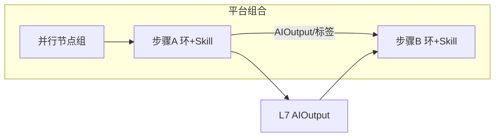

# Planning · 模块一：背景与编排原则

> **喂食核心 · 模块一**（对应平台控制环 **Plan** · `agents/planning/`）  
> 虚构企业：**青枢出行（Qingshu Mobility）**  
> 总架构：[BLUEPRINT.md](../../BLUEPRINT.md) · [设计决策](../design-decisions.md)  
> 版本：V2.1 · 2026-08-07

---

## 1. Plan 在平台中的位置

企业 AI 成品 = **平台 4 环 + 3 类工具 + 部门 Skills**（见蓝图）。Plan 是四环之一：

| 轴 | 做法 |
|----|------|
| 平台环 | 读共享 → 闸门 / 多步计划 →（可选）驱动下游 Skill |
| 业务差异 | 挂 Skill（如 `renewal_plan`），不复制 Act/Extract 环 |
| 反孤岛 | 只消费 L7 共享资产；跨部门不直连私库 |

本目录文档职责：

1. Plan 与 **组合契约**原则（本文）  
2. 分部门类型层 + Skill 层图（[02](./02-模块二-分部门编排图.md)）  
3. 机读 `department_flows` 与 catalog（[03](./03-模块三-机读契约与catalog对接.md)）  

**本阶段**：契约 + 机读流为主；`agents/planning` 控制环运行时可仍为 planned（Story2 闸门语义已在 Write/Govern 工具侧可演示）。

---

## 2. 为何文档里还有「顺序」——但不是 Agent 接力

**运行时**：一次只跑 **一个 Skill（一个功能）**，在该功能所属控制环内用工具做完。

文档中的「顺序 / sequence」只表示 **数据依赖**（例如续费闸门功能要读到投诉标签，通常先有人跑过填单/打标功能并写入共享层）。那是：

1. 运行功能 A → 写 `AIOutput`  
2. **另一次**运行功能 B → 读共享层  

**不是** Extract Agent 做完把话筒交给 Act Agent。

并行 = 两个功能可独立演示、无强制先后（如 `ticket_fields` ∥ `fill_ticket` 为同域可选能力）。

---

## 3. 串行 vs 并行

| `mode` | 含义 | 典型 `via` |
|--------|------|------------|
| `sequence` | 上一步产出是下一步前提 | `AIOutput` · `tag_id` · `payload_schema:…` |
| `parallel` | 同组无先后依赖 | 可空；汇合后再接串行边 |

---

## 4. 跨部门边界

| 允许 | 禁止 |
|------|------|
| 读写共享 `AIOutput` / 统一标签 | Agent/Skill 互聊当主路径 |
| 一功能一 Skill，一次运行一个 | 「上环跑完自动交给下环」的管道 |
| flows 上标注 `via` 共享依赖说明 | 把 Plan 做成全公司单编排器 / 联跑引擎 |

---

## 5. 反模式

- 万能 System Prompt 当企业大脑  
- 按部门复制控制环 / DataFetcher  
- Multi-Agent 互聊当协作  
- 用 Plan 环冒充单 Orchestrator  
- 把 flows JSON 当成已实现的自动联跑引擎（契约 ≠ 运行时）  
- Agent 互相对话或「上一个 Agent 做完给下一个」

---

## 6. 相关文档

| 文档 | 关系 |
|------|------|
| [BLUEPRINT](../../BLUEPRINT.md) | 平台 4×3 总架构 |
| [design-decisions](../design-decisions.md) | DD-03/06/07 等 |
| [react/extraction/rag docs](../react/01-模块一-背景-跨部门功能-语气.md) | 其余三环喂食 |
| [skills/SCHEMA.md](../../skills/SCHEMA.md) | Skill 契约；flow 真相在 JSON |
