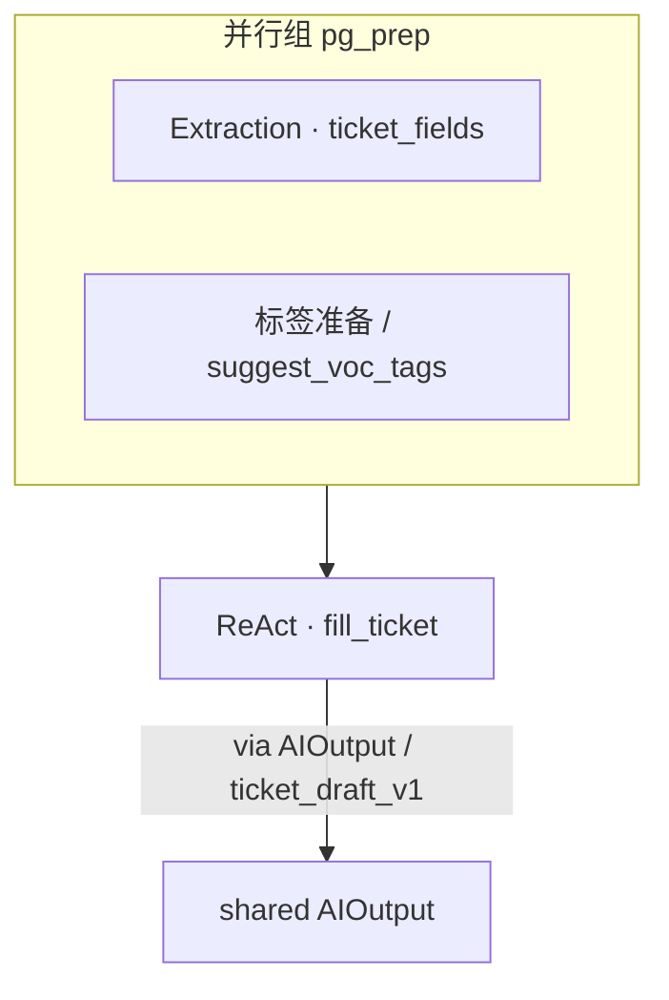
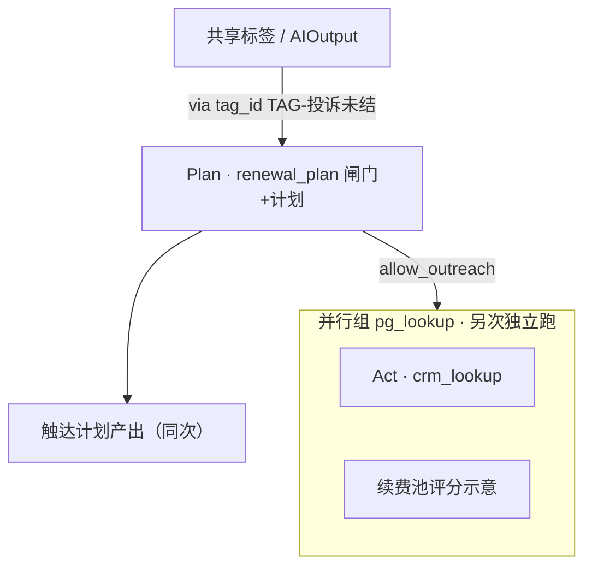

# Planning · 模块二：分部门编排图

> **喂食核心 · 模块二**  
> 每张图含 **类型层** + **Skill 层**；标注串行边与并行组  
> Demo 必跑：Story1（服务）· Story2（用户运营闸门）  
> 机读源：`data/entities/department_flows.json`  
> 版本：V1.0 · 2026-08-05

---

## 图例

| 符号 | 含义 |
|------|------|
| `→` / `mode: sequence` | 串行：上一步产出是下一步前提 |
| `∥` / `parallel_groups` | 并行：同组无先后依赖 |
| `via` | 共享契约（`AIOutput` / `tag_id` / schema） |
| ★ | `demo_ready: true`（对齐 Story） |

---

## 1. 服务事业部 ★ Story1 + RAG

**flow_id**：`service_ticket_to_shared` · Story1  
**flow_id**：`service_repair_qa` · RAG 维修问答（`demo_ready: true`）

### 类型层（填单）

```text
Extraction(ticket_fields)  ∥  规则/标签准备(suggest_voc_tags 等)
              ╲                ╱
               ↘              ↙
            ReAct(fill_ticket)  ——write→  AIOutput
```

### 类型层（RAG · 并行正交）

```text
RAG(repair_kb)  ← 辅助回答 / 维修 KB（不串进 Story1）
```

- 并行组 `pg_prep`：`ticket_fields` 与标签准备可同时进行（示意节点 `n_tag_prep`）  
- 串行：准备完成 → `fill_ticket` 写共享（`via: payload_schema:ticket_draft_v1` / `AIOutput`）
- RAG 与填单：**并行存在 / 正交**，见 `docs/rag/02`

### Skill 层

| 节点 | skill_id | 角色 |
|------|----------|------|
| n1 | `ticket_fields` | 抽工单草案 |
| n2 | `fill_ticket` | 工具闭环 + `write_ai_output` |
| n_rag | `repair_kb` | 维修知识问答 + 引用 |
| （下游跨部门） | `renewal_plan` · `voc_tagging` | 只读消费，不在本流内执行 |



**对应功能**：`F-SVC-001` · `F-SVC-001-EXT`

---

## 2. 用户运营 / App ★ Story2

**flow_id**：`user_ops_renewal_gate`

### 类型层

```text
读共享标签 / AIOutput
        →
Rule+LLM 或 Planning 闸门（投诉未结 → 阻断）
        →（未阻断才）
Planning 触达计划 / 话术编排

查数 ReAct(crm_lookup 等)  ∥  意向/续费池评分（示意）
```

- 串行：共享标签 → 闸门 → 触达计划  
- 并行组 `pg_lookup`：查主数据与续费池评分可并行（闸门通过后或准备阶段）

### Skill 层

| 节点 | skill_id | 说明 |
|------|----------|------|
| n_read | （store 读） | 消费 `fill_ticket` / `ticket_fields` / `voc_entities` 产出 |
| n_gate | `renewal_plan` | Plan Skill **已落地**：闸门 +（放行时）短触达计划同次产出 |
| n_plan_out | （占位） | 非独立 Skill；对应同次 `plan` 字段 |
| n_crm | `crm_lookup` | 放行后另次独立跑（F-UO-019），非 Plan 管道 |
| n_score | （示意） | 评分示意；工具已在 `renewal_plan` 放行路径内 |



**对应功能**：`F-UO-017`（demo_ready · `renewal_plan`）；`F-UO-001` / `F-UO-019` 仍为展示或并行可选

---

## 2.1 用户运营 · App RAG 问答 ★

**flow_id**：`user_ops_app_qa` · `demo_ready: true`

```text
RAG(repair_kb)  —— App 内维修/使用问答
        ∥（无关）
续费闸门 user_ops_renewal_gate
```

- 与续费触达 **并行无关**；一期复用 `repair_kb`  
- **对应功能**：`F-UO-009`

---

## 3. 渠道处（示意 · RAG 节点已挂 Skill）

**flow_id**：`channel_ops_board`

### 类型层

```text
ReAct(channel_ops) 查经营指标  ∥  RAG(policy_kb)
              ╲                    ╱
               ↘                  ↙
            看板/简报汇合（Planning，仍 planned）
```

### Skill 层

- `channel_ops`：一代健康、预警等工具查询  
- `policy_kb`：政策/口径问答（渠道专用 `channel_kb` 未建，一期复用）  
- 整流通 `demo_ready: false`（汇合节点未实现）；两节点可各自试跑

---

## 4. 订单 / 政策

### 4.1 审单串行（示意）

**flow_id**：`order_policy_review` · `demo_ready: false`

```text
Extraction(订单字段，planned) → Rule+LLM(政策档位闸门) → ReAct(审单辅助，planned)
```

### 4.2 政策口径 RAG ★

**flow_id**：`order_policy_qa` · `demo_ready: true`

```text
RAG(policy_kb)  —— 三包/返利/续费红线问答
        ∥（并列，不进审单闸门）
order_policy_review
```

- **对应功能**：`F-POL-RAG`

---

## 5. 用研 / VoC（示意）

**flow_id**：`voc_entities_to_shared`

### 类型层

```text
Extraction(voc_entities / voc_tagging) → write AIOutput
         ∥（可与服务填单并行产生标签，但写共享后按 consumer 消费）
```

### Skill 层

| skill_id | 关系 |
|----------|------|
| `voc_entities` · `voc_tagging` | 同源打标；可与服务侧准备 **并行** 于不同部门流 |
| 下游 | `renewal_plan` 等只读 `AIOutput` |

**注意**：与服务 `fill_ticket` 的协作是 **共享产出**，不是两部门 Agent 互聊。

---

## 6. 人资 · 制度 RAG ★

**flow_id**：`hr_policy_qa` · `demo_ready: true`

```text
RAG(hr_rules)  —— 制度 / 坐席 SOP 问答
```

- **对应功能**：`F-HR-001`

---

## 7. 制造质检 / IoT 质量联动（示意）

**flow_id**：`iot_quality_inspect`

> 目录中质量角色挂在 `iot`；无独立「制造」department_id，示意挂此部门。

### 类型层

```text
Vision(巡检/质检图，planned) ∥ Extraction(OBD/质检字段，planned)
                ╲              ╱
                 ↘            ↙
              Rule+LLM 或 ReAct 汇合写告警/共享标签
```

### Skill 层

- 并行：图像理解与结构化字段  
- 串行：汇合后写 `AIOutput` / Alert，供渠道或服务只读

---

## 8. Demo 必跑对照

| Story / 线 | flow_id | demo_ready | 说明 |
|------------|---------|------------|------|
| Story1 | `service_ticket_to_shared` | ✅ | 填单资产化 |
| Story2 | `user_ops_renewal_gate` | ✅ | 读共享 → 闸门；触达 Skill 运行时仍 planned |
| RAG 维修 | `service_repair_qa` | ✅ | repair_kb |
| RAG App | `user_ops_app_qa` | ✅ | 复用 repair_kb |
| RAG 政策 | `order_policy_qa` | ✅ | policy_kb |
| RAG 人资 | `hr_policy_qa` | ✅ | hr_rules |

下一模块：[03 · 机读契约与 catalog 对接](./03-模块三-机读契约与catalog对接.md)
