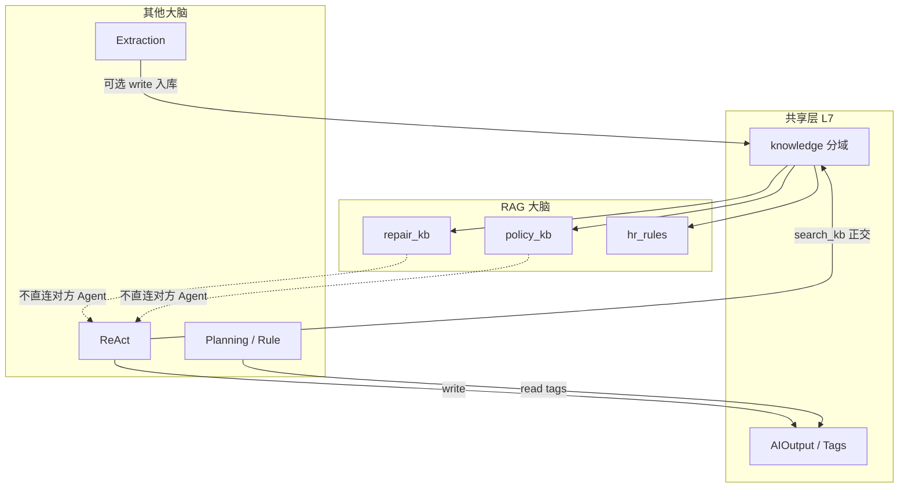

# RAG · 模块二：与其他 Agent 的关系编排

> **喂食核心 · RAG 模块二**  
> 部门内：RAG Skill 与 Extraction / ReAct / Planning / Rule+LLM / Vision 的 **并行 · 串行 · 正交**  
> 跨部门：只经共享层（`AIOutput` / 标签 / 统一 kb），不 Multi-Agent 互聊  
> 机读可后续写入 `department_flows.json`（RAG 节点 `agent_type: rag`）  
> 版本：V1.0 · 2026-08-05

---

## 0. 三种关系（全局）

| 关系 | 定义 | Demo 表现 |
|------|------|-----------|
| **正交（Orthogonal）** | 同一 Tool（`search_kb`）可被 RAG 控制环或 ReAct 工具步调用；两条路径独立 | 不强制先后；面试口径：「手脚统一、大脑不同」 |
| **并行（Parallel）** | 无数据前提，可同时触发；产出可汇合 | `parallel_groups`；网页并排卡 |
| **串行（Sequence）** | 上游产出是下游前提（schema / AIOutput / 更新后的 kb 切片） | 卡片标上下游；一期 **不自动联跑** |

反模式：为「维修脑 / 政策脑」各建一套向量库与 DataFetcher。

---

## 1. 按部门：RAG ↔ 其他 Agents

### 1.1 服务事业部 ★

```text
[RAG · repair_kb]  ←—— 纯知识问答（辅助回答 / 维修 KB）
        ∥ 正交
[ReAct · fill_ticket / crm_lookup]  ←—— 查主数据、写 AIOutput
        ∥ 并行可选（Story1）
[Extraction · ticket_fields / voc_*]
```

| RAG Skill | 对方 | 关系 | via / 说明 |
|-----------|------|------|------------|
| `repair_kb` | ReAct `fill_ticket` | **正交 / 并行可选** | 填单不依赖 RAG；坐席可先问知识再填单（人工顺序） |
| `repair_kb` | ReAct `crm_lookup` | **并行准备 → 人工汇合答** | 查车/工单 ∥ 检索维修条文，再组织答复（F-SVC-003） |
| `repair_kb` | Extraction `ticket_fields` | **并行** | 各写各的；无强制边 |
| `repair_kb` | Planning / Rule | **无一期边** | 客诉专报等属 Planning，不经 RAG 互聊 |

**不建边**：RAG → write_ai_output 作为 Story1 主路径（Story1 已由 ReAct/Extraction 承担）。RAG 一期成功标准 = **有依据的终答 + 引用 chunk**，可选写 `AIOutput` 作旁路示意。

---

### 1.2 用户运营 / App

```text
共享标签 / AIOutput
        →（串行）
Rule/Planning · renewal_plan 闸门
        ∥
[RAG · repair_kb / app_qa]  ← App 内问答，与续费闸门无关
```

| RAG Skill | 对方 | 关系 | 说明 |
|-----------|------|------|------|
| App 问答 | Story2 `renewal_plan` | **无关 / 并行存在** | 续费触达不读 RAG；投诉闸门读标签 |
| App 问答 | ReAct 统一客服 | **串行可选** | 先 RAG 答 FAQ，复杂单转 ReAct 查单（二期） |
| kb 自动更新 F-UO-010 | Extraction | **串行** | Extraction 摘要 → 入库 → RAG 才能检索到新内容 |

---

### 1.3 订单 / 政策

```text
Extraction(政策字段) → Rule+LLM(档位闸门) → ReAct(审单补查)
         ∥
   [RAG · policy_kb]  ← 口径问答，不替代闸门
```

| RAG Skill | 对方 | 关系 | 说明 |
|-----------|------|------|------|
| `policy_kb` | Extraction 政策解析 | **并行可选** | 解析出结构化档位；RAG 答「什么叫三包」 |
| `policy_kb` | Rule+LLM 返利/风控 | **正交** | 规则表决策；RAG 不改档位 |
| `policy_kb` | ReAct 审单 | **并行准备** | 查订单 ∥ 检索政策条文，再建议 |

串行硬依赖：**没有**「必须先 RAG 再 Rule」——闸门以结构化字段/规则表为准。

---

### 1.4 渠道处 ★（已有 flow 示意）

**flow_id**：`channel_ops_board`（`department_flows.json`）

```text
ReAct(channel_ops) 查经营指标  ∥  RAG(policy/channel)
              ╲                    ╱
               ↘                  ↙
            看板/简报汇合（Planning 或 NLG，planned）
```

| 节点 | 关系 | via |
|------|------|-----|
| `n_ops` ∥ `n_rag` | **并行组** | 无先后 |
| 两者 → 汇合输出 | **串行汇合** | 指标 + 知识引用 → 简报 |

一期：并行组可跑 ReAct `channel_ops`；RAG 节点控制环就绪后挂上，**不自动联跑**。

---

### 1.5 四大战区 / 新零售

| 链路 | 关系 | 说明 |
|------|------|------|
| 线下问答 RAG ∥ 建单 ReAct | **并行** | F-WZ-001 问答 vs F-WZ-002 审单 |
| 客服 RAG ∥ 查库存/订单 ReAct | **并行** | F-RET-001/002 |
| 提货话术 RAG → Planning 激活包 | **弱串行** | 知识引用进 A–E 包文案（planned） |

---

### 1.6 人资

| RAG Skill | 对方 | 关系 | 说明 |
|-----------|------|------|------|
| `hr_rules` | ReAct 员工助理工具步 | **正交** | 一期主推 RAG 控制环；ReAct 仅 `search_kb(hr)` 示意亦可 |
| `hr_rules` | Extraction 岗位匹配 | **并行** | 招聘：问答 ∥ 简历字段抽取 |
| `hr_rules` | 其他部门 | **共享只读** | 跨部门消费同一 `hr` 域，不复制库 |

---

### 1.7 数据研究院 / 共享层

| 角色 | 关系 |
|------|------|
| 统一索引 / DataFetcher.knowledge | **被所有 RAG Skill 依赖**（底座串行前提：先有 doc + index） |
| Extraction 资产入库 → kb | **串行供给**（📋） |
| 智能问数 ReAct | **正交**：查数 ≠ 查文档；语义释义可用 RAG 旁路 |

---

### 1.8 IoT / VoC / 采购等

| 部门 | 典型关系 | 一期 |
|------|----------|------|
| IoT | Rule 告警 ∥ RAG 解释 OTA 文档 | 展示 |
| VoC | Extraction 打标 → Planning 报告；RAG 向导独立 | 展示 |
| 采购 | Rule 风控 ∥ RAG 条款（无库） | 展示 |
| Vision 质检 | **无 RAG 边** | Vision 主轴 |

---

## 2. 跨部门矩阵（摘要）



| From \ To | Extraction | ReAct | Planning/Rule | Vision |
|-----------|------------|-------|---------------|--------|
| **RAG** | 并行（多数） | 正交或并行准备 | 弱串行汇合（简报） | 无 |
| **Extraction → RAG** | — | — | — | — |
| （入库后） | **串行供给 kb** | — | — | — |

---

## 3. 已写入 flows 的 RAG 流（机读真相）

| flow_id | department_id | demo_ready | 节点关系 |
|---------|---------------|------------|----------|
| `service_repair_qa` | service | ✅ | 单节点 RAG `repair_kb`；与 Story1 **并行存在** |
| `user_ops_app_qa` | user_ops | ✅ | 单节点；与 `user_ops_renewal_gate` **并行无关** |
| `order_policy_qa` | order_policy | ✅ | 单节点 `policy_kb`；与审单串行流并列 |
| `hr_policy_qa` | hr | ✅ | 单节点 `hr_rules` |
| `channel_ops_board` | channel | 半就绪 | ReAct `channel_ops` ∥ RAG `policy_kb` → 汇合仍 planned |

机读源：`data/entities/department_flows.json`。维护约定：改图同步 [docs/planning/02](../planning/02-模块二-分部门编排图.md) 与本文件。

---

## 4. 网页 / 运维口径

| 场景 | 口径 |
|------|------|
| Story1/2 | **不依赖** RAG；RAG 是第三条「知识大脑」Demo 线 |
| 业务墙 | `demo_ready` 的 RAG Skill 可「打开运行」；其余板块展示关系说明 |
| 与 ReAct 同页 | 标明「并行可选」或「正交 search_kb」，避免用户以为必须先跑 RAG |

下一模块：[03 · 一期 Demo 范围与排期](./03-模块三-一期Demo范围与排期.md)
